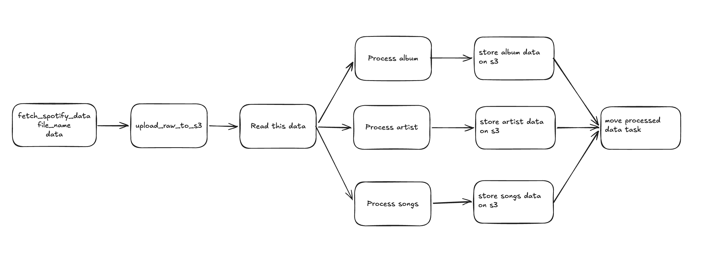
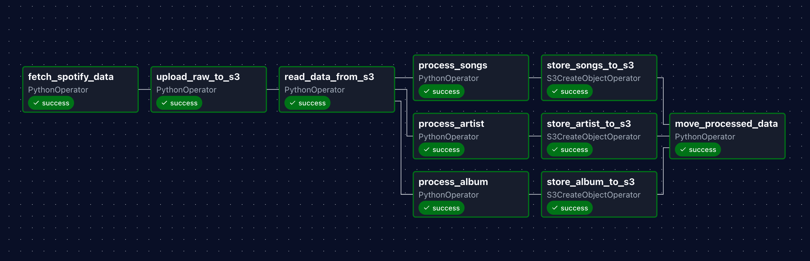
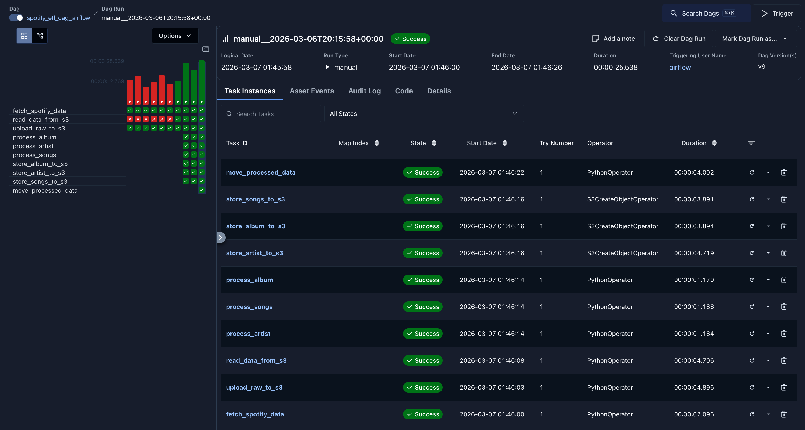
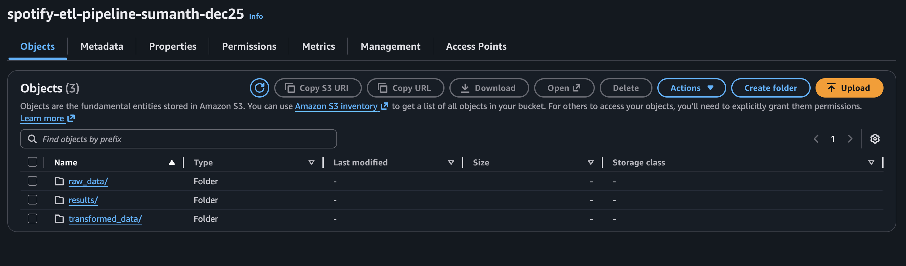
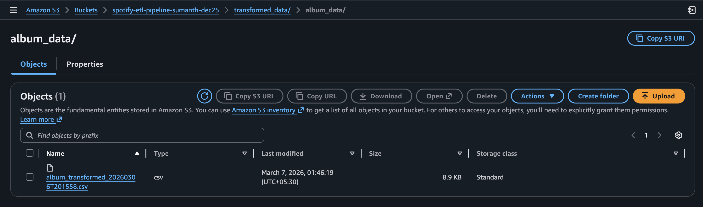

# Spotify ETL Pipeline — Apache Airflow + AWS S3

An end-to-end data engineering pipeline that extracts track, album, and artist data from a Spotify playlist daily, transforms it into structured CSVs, and loads them into AWS S3 — orchestrated entirely with Apache Airflow running in Docker.

---

## Architecture

<p align="center">
  
</p>

---

## Airflow DAG Graph

<p align="center">
  
</p>

---

## How It Works

The pipeline runs on a daily schedule via an Airflow DAG with 10 tasks across 4 stages:

**1. Extract**
- Connects to the Spotify API using `spotipy` and pulls all tracks from a configured playlist
- Saves raw JSON locally in `/tmp` and uploads it to `s3://spotify-etl-pipeline-sumanth-dec25/raw_data/to_processed/`

**2. Read**
- Reads all raw JSON files from S3 and pushes the data downstream via Airflow XCom

**3. Transform**
- Three parallel tasks process albums, artists, and songs independently
- Deduplicates records, parses dates, and serialises each dataset as a CSV
- Uploads transformed CSVs to `s3://.../transformed_data/{album_data | artist_data | songs_data}/`

**4. Archive**
- Moves processed raw files from `raw_data/to_processed/` to `raw_data/processed/` and deletes the originals

---

## DAG

<p align="center">
  
</p>

| Task | Type | Description |
|---|---|---|
| `fetch_spotify_data` | PythonOperator | Calls Spotify API, writes raw JSON to /tmp |
| `upload_raw_to_s3` | PythonOperator | Uploads raw JSON file to S3 |
| `read_data_from_s3` | PythonOperator | Reads all files from S3 to_processed prefix |
| `process_album` | PythonOperator | Extracts and deduplicates album records |
| `process_artist` | PythonOperator | Extracts and deduplicates artist records |
| `process_songs` | PythonOperator | Extracts song records with album/artist IDs |
| `store_album_to_s3` | S3CreateObjectOperator | Uploads album CSV to S3 |
| `store_artist_to_s3` | S3CreateObjectOperator | Uploads artist CSV to S3 |
| `store_songs_to_s3` | S3CreateObjectOperator | Uploads songs CSV to S3 |
| `move_processed_data` | PythonOperator | Archives raw JSON from to_processed → processed |

---

## S3 Bucket Structure

```
spotify-etl-pipeline-sumanth-dec25/
├── raw_data/
│   ├── to_processed/        ← raw JSON lands here
│   └── processed/           ← moved here after transformation
└── transformed_data/
    ├── album_data/          ← album CSVs
    ├── artist_data/         ← artist CSVs
    └── songs_data/          ← song CSVs
```

<p align="center">
  
</p>

---

## Tech Stack

- **Orchestration:** Apache Airflow 3.x
- **Containerisation:** Docker + Docker Compose
- **Cloud Storage:** AWS S3
- **Language:** Python 3.12
- **Key Libraries:** `spotipy`, `pandas`, `apache-airflow-providers-amazon`
- **Data Source:** Spotify Web API

---

## Setup

### Prerequisites
- Docker and Docker Compose installed
- A Spotify Developer account
- An AWS account (free tier works)

### 1. Clone the repo

```bash
git clone https://github.com/sumanthmalipeddi/spotify-etl-aws-airflow.git
cd spotify-etl-aws-airflow
```

### 2. Create a Spotify App

1. Go to [Spotify Developer Dashboard](https://developer.spotify.com/dashboard)
2. Click **Create App**
3. Fill in any name and description, set redirect URI to `http://localhost`
4. Copy the **Client ID** and **Client Secret** — you'll need these in Step 5

### 3. Set up AWS S3 Bucket and IAM User

**Create an S3 Bucket:**
1. Go to AWS Console → S3 → **Create bucket**
2. Bucket name: pick any unique name (e.g. `spotify-etl-pipeline-yourname`)
3. Region: choose your preferred region
4. Leave all other settings as default → **Create bucket**

**Create an IAM User with S3 access:**
1. Go to AWS Console → IAM → Users → **Create user**
2. Username: `airflow-s3-user`
3. Click Next → Select **Attach policies directly**
4. Search and select `AmazonS3FullAccess` → Next → **Create user**
5. Click on the user → **Security credentials** tab → **Create access key**
6. Select **Third-party service** → confirm → Next → **Create access key**
7. Copy the **Access Key ID** and **Secret Access Key** — you'll need these in Step 6

> **Important:** If you use your own bucket name, update the `bucket_name` value in `dags/spotify_etl_pipeline.py` (search for `spotify-etl-pipeline-sumanth-dec25` and replace it with yours).

### 4. Start Airflow

```bash
docker-compose build
docker-compose up -d
```

Airflow UI will be available at `http://localhost:8080`
Default credentials: `airflow / airflow`

Wait 1-2 minutes for all services to become healthy. You can check with:

```bash
docker-compose ps
```

All services should show `(healthy)` status before proceeding.

### 5. Configure Airflow Variables

Go to **Admin → Variables** and add these two entries:

| Key | Value |
|---|---|
| `spotify_client_id` | Client ID from Step 2 |
| `spotify_client_secret` | Client Secret from Step 2 |

### 6. Configure AWS Connection

Go to **Admin → Connections → Add** (click the `+` button):

| Field | Value |
|---|---|
| Conn ID | `aws_s3_spotify` |
| Conn Type | `Amazon Web Services` |
| Login | Access Key ID from Step 3 |
| Password | Secret Access Key from Step 3 |

### 7. Trigger the DAG

1. Go to the **DAGs** page in Airflow UI
2. Find `spotify_etl_dag_airflow` and toggle it **ON**
3. Click the **play button** (trigger) to run it manually
4. Click on the DAG run to monitor task progress — all 10 tasks should turn green

---

## Output

<p align="center">
  
</p>

Three CSVs are produced per run, timestamped and stored in separate S3 prefixes:

- `album_transformed_<timestamp>.csv` — album ID, name, release date, total tracks, URL
- `artist_transformed_<timestamp>.csv` — artist ID, name, external URL
- `songs_transformed_<timestamp>.csv` — song ID, name, duration, popularity, added date, album ID, artist ID

---

## Troubleshooting

| Issue | Fix |
|---|---|
| Tasks fail with `Signature verification failed` | Run `docker-compose down -v && docker-compose up -d` to regenerate the shared config |
| Tasks fail with `Network is unreachable` | Your Docker containers have no internet. Restart Docker Desktop and try again |
| `Variable not found` error | Make sure you added both Spotify variables in **Admin → Variables** (Step 5) |
| S3 access denied | Verify the AWS Connection credentials in **Admin → Connections** (Step 6) and that your IAM user has `AmazonS3FullAccess` |
| DAG not visible in UI | Wait 1-2 minutes for the DAG processor to parse the file. Check `docker-compose ps` for healthy services |

> **Note:** The `config/` directory is auto-generated on first run by Airflow and contains an `airflow.cfg` with auto-generated secrets. It is gitignored and should not be committed. If you run into auth issues, delete it and restart: `rm -rf config/ && docker-compose down -v && docker-compose up -d`

---

## Project History

This project evolved through two phases:

1. **Phase 1 — Serverless:** AWS Lambda + CloudWatch for extraction and transformation. Hit limitations with observability, dependency management, and debugging. Original files preserved on the [`phase1-lambda`](https://github.com/sumanthmalipeddi/spotify-etl-aws-airflow/tree/phase1-lambda) branch.
2. **Phase 2 — Airflow:** Migrated to Airflow 3.x with CeleryExecutor for DAG-based orchestration, parallel transforms, retry logic, and a unified monitoring UI.

See [DESIGN_DOC.md](DESIGN_DOC.md) for the full architecture evolution and trade-off analysis.
